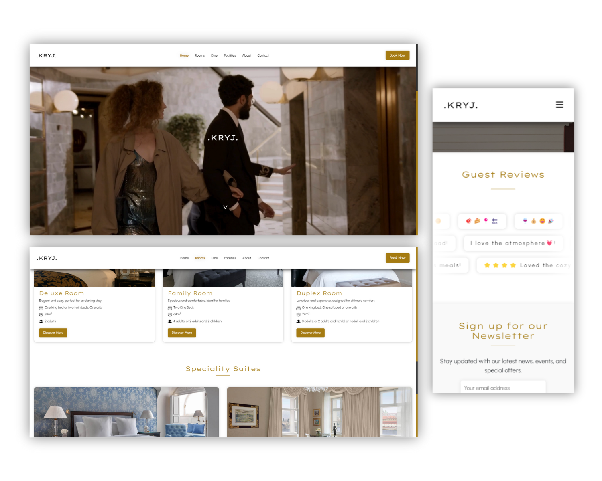

<h1 align="center">KRYJ Hotel</h1>

**Duration:** April 2024 - July 2024  
**Team Size:** 3  
**Role:** Front-end Developer, Designer  
**Technologies:** HTML, CSS, JavaScript, Bootstrap  

    
Click to view project images

    

## 1. Project Scope / Client’s Problem

The goal of this project was to design a fully responsive and user-friendly website prototype for a fictional hotel, **KRYJ Hotel**. The website needed to provide an intuitive booking experience, highlight hotel features, and maintain a modern aesthetic across all devices.

## 2. My Role & Solution

As the **Front-end Developer and Designer**, I worked on the website layout, UI/UX design, and implementation. My responsibilities included:

- Developing a **responsive front-end** using HTML, CSS, and JavaScript.
- Utilizing **Bootstrap** for mobile-friendly design.
- Ensuring a clean, modern, and easy-to-navigate interface.

## 3. My Work Process

1. **Wireframing & Design**  
   - Created mockups using Figma.
   - Defined a color scheme and typography for a professional look.

2. **Development & Implementation**  
   - Built the landing page, booking system UI, and gallery.
   - Ensured smooth responsiveness with Bootstrap and media queries.

3. **Testing & Optimization**  
   - Conducted user testing to improve the interface.
   - Optimized performance and loading times.

 

---

     
    <i>END</i>

