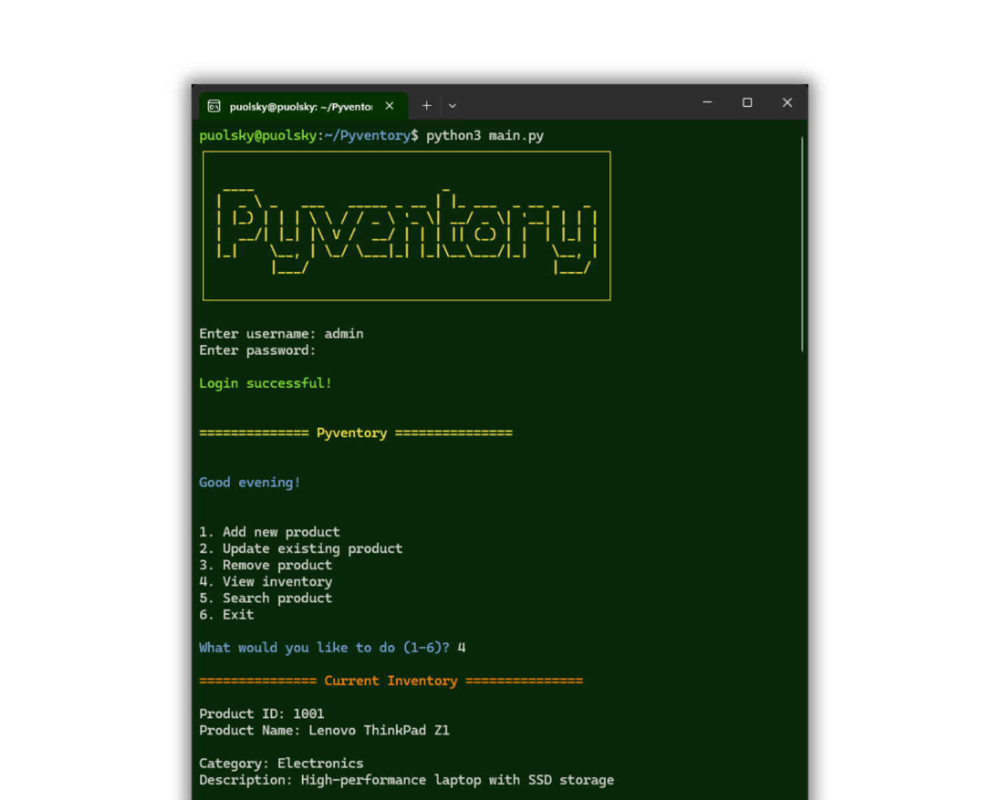

<h1 align="center">Pyventory</h1>

**Duration:** May 2024 - July 2024  
**Team Size:** 1  
**Role:** Programmer  
**Technologies:** Python

<details>
    <summary>Click to view project images</summary>
    
</details>

## Project Scope / Client's Problem

Manual inventory management is often tedious and error-prone. Pyventory is a command-line based inventory management system built in Python to help users track and manage stock efficiently.

## Role & Solution

I developed Pyventory as a solo project. The tool allows users to add, remove, and search inventory items through an easy-to-use command-line interface, streamlining the process of inventory management.

## Work Process

- **Planning:** Outlined core features such as adding, removing, and searching items.
- **Development:** Implemented the system in Python with clear, concise commands.
- **Testing:** Rigorously tested all functionalities to ensure reliability.

## Additional Features

Besides the standard CRUD functionalities and the additional features mentioned in the assignment brief, these are something extra:

- **Search Engine:** A search functionality for products.
- **Login (Basic):** Basic login page for user authentication.
- **Data Storage (CSV):** Product data is stored in CSV format for persistence.
- **User Experience?** Not exactly a feature, but the idea is present throughout the whole program, from using appropriate whitespace, to colored text, etc.

### Example Code

```python
def add_item(inventory, item, quantity):
    """
    Add an item to the inventory.
    """
    if item in inventory:
        inventory[item] += quantity
    else:
        inventory[item] = quantity
    return inventory

# Sample usage
inventory = {}
inventory = add_item(inventory, 'apple', 10)
print("Updated Inventory:", inventory)
```

### Outcome & Results Achieved

- Created a fully functional inventory management tool.
- Simplified inventory tracking with an intuitive command-line interface.
- Strengthened my Python programming and problem-solving skills.

<br>

---

<p align="center">
    <br>
    <i>END</i>
</p>
