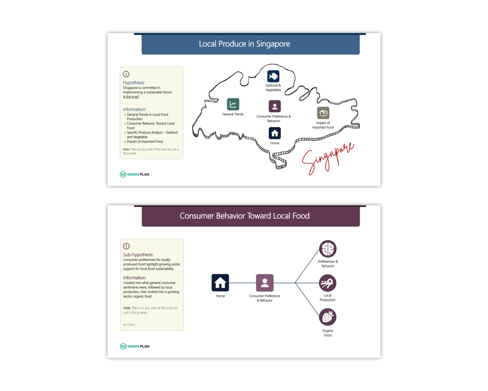
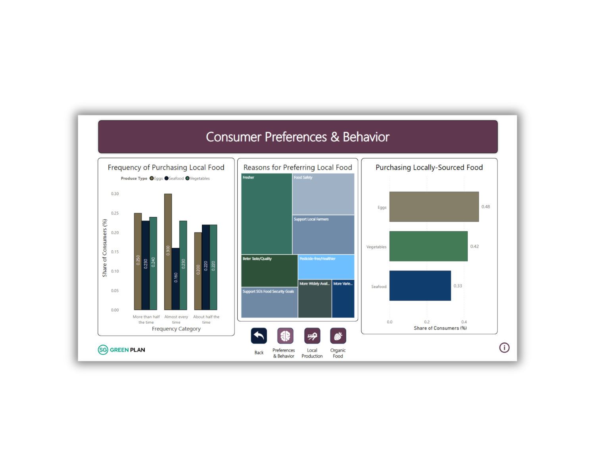
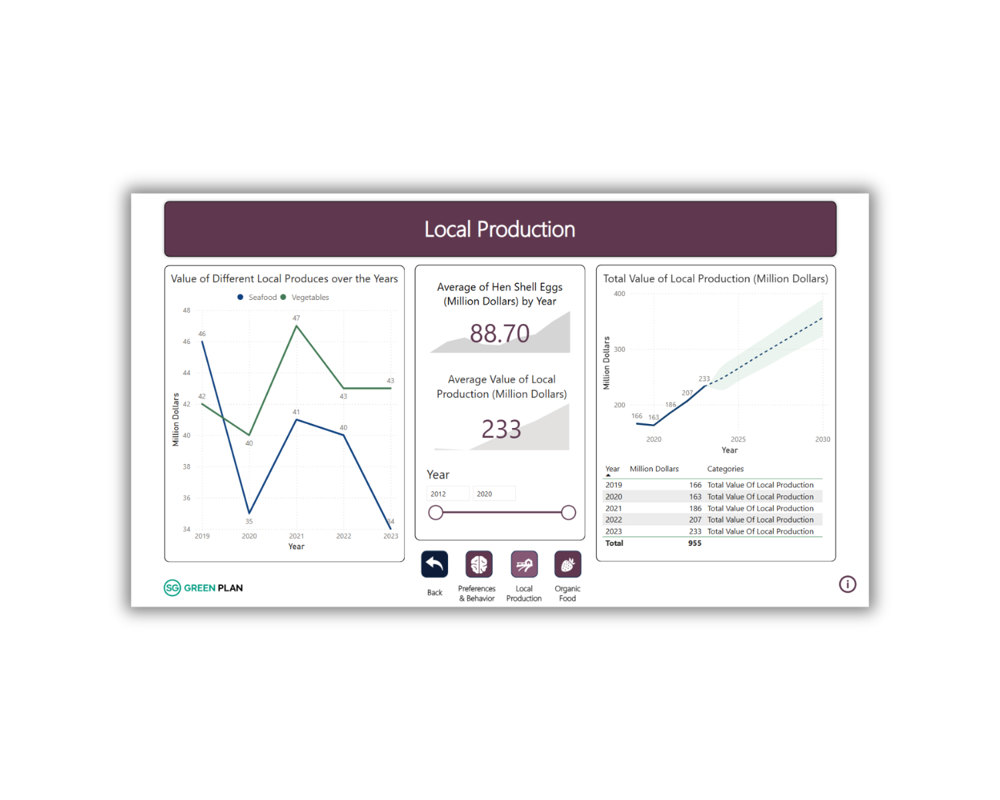
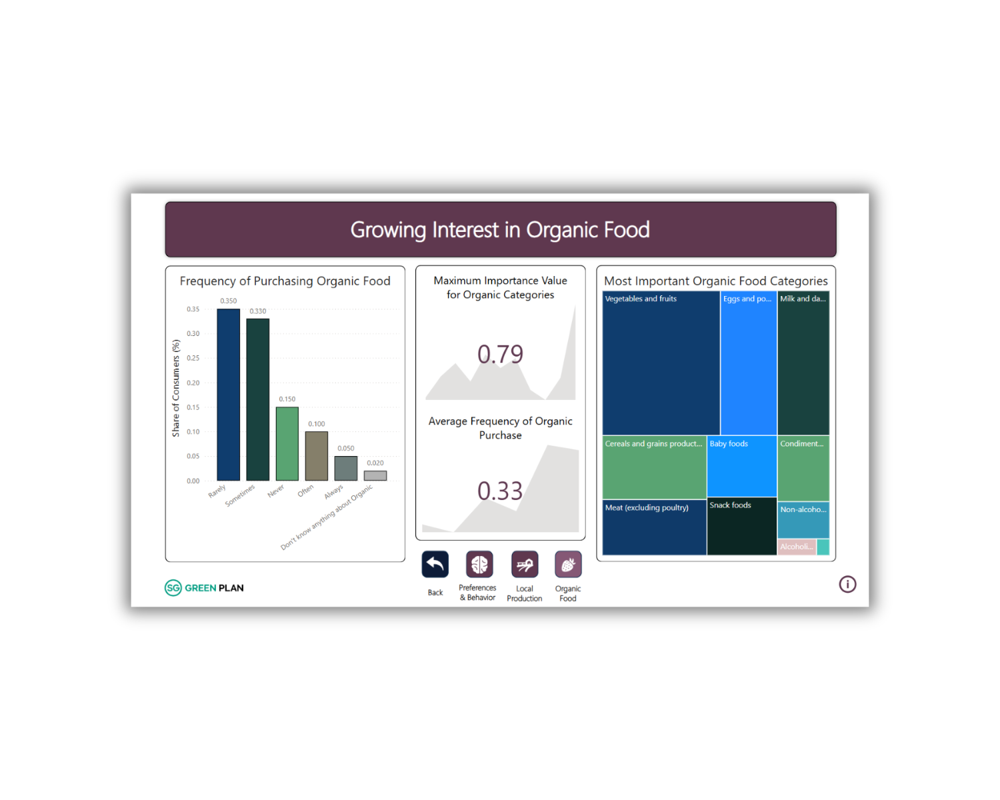

<h1 align="center">Visual Analytics Project</h1>

**Duration:** December 2024 - February 2025  
**Team Size:** 4  
**Role:** Team Lead, Designer  
**Technologies:** Power BI, Excel

<details>
    <summary>Click to view project images</summary>
    
    
    <br>
    
    
</details>

## Project Scope / Client’s Problem

Consumers in Singapore are becoming more aware of food sustainability, but many still prefer imported products over locally produced food. This project aimed to analyze consumer behavior, trends, and challenges surrounding local food production using data visualization and forecasting.

## My Role & Solution

As the **Team Lead and Designer**, I guided the project, delegated tasks, and ensured smooth collaboration. I was also responsible for designing the Power BI dashboard, ensuring clear and effective data visualizations. My solution involved cleaning raw datasets, identifying key patterns, and presenting findings in an interactive and user-friendly format.

## My Work Process

1. **Data Collection & Cleaning**  
   - Gathered datasets on local food consumption and imports.
   - Cleaned and formatted data using Excel to remove inconsistencies.

2. **Data Analysis & Visualization**  
   - Identified key consumer trends through statistical methods.
   - Used Power BI to create interactive dashboards showcasing insights.

3. **Findings & Recommendations**  
   - Explored barriers to local food adoption and suggested strategies.
   - Provided actionable insights for stakeholders to promote sustainable food choices.

### Sample DAX Used

```py
Forecast Value = 
VAR GrowthRate = 
    (MAX('Local Production'[Value]) - MIN('Local Production'[Value])) / 
    (MAX('Local Production'[Year]) - MIN('Local Production'[Year]))

VAR UpcomingYears = MAX('Local Production'[Year]) - MIN('Local Production'[Year]) + 1

RETURN 
    MAX('Local Production'[Value]) + (GrowthRate * UpcomingYears)
```

<br>

---

<p align="center">
    <br>
    <i>END</i>
</p>